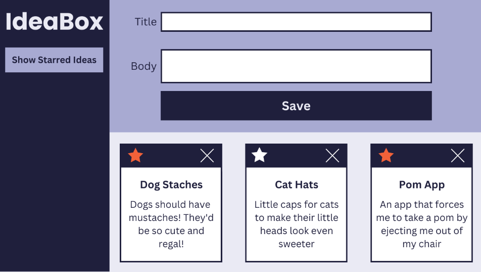

[project details](https://frontend.turing.edu/projects/module-1/ideabox-group.html)  
[deployed site link](https://yuji3000.github.io/idea-box/) 
Currently Working On Iteration 4

<h2> Iteration 0 </h2>
<h3> Basic Layout </h3>

<h2> Iteration 1 </h2>
<h3> Adding Ideas </h3>

<h2> Iteration 2 </h2>
<h3> Deleting Ideas </h3>

<h2> Iteration 3 </h2>
<h3> Favoriting Ideas </h3>

<h2> Iteration 4 </h2>
<h3> Filtering Ideas </h3>

